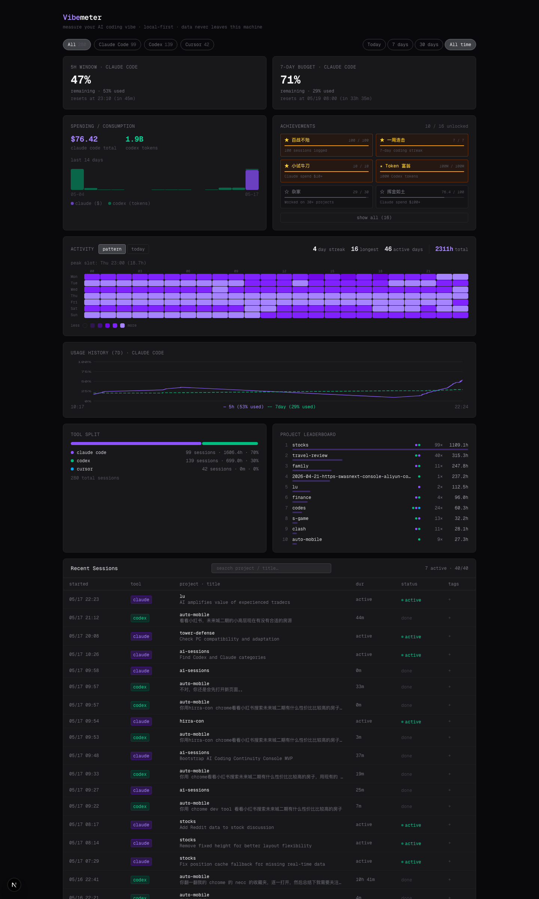

# Vibemeter

> Measure your AI coding vibe. A local-first dashboard for Claude Code, Codex, and Cursor.

Vibemeter scans your local AI tool session logs and shows you:

- **5h / 7-day rate-limit windows** — for both Claude Code (statusline) and Codex (rollout files)
- **Spending & consumption** — Claude Code USD spent + Codex tokens used, with a 14-day trend chart
- **Activity heatmap** — when in the week you actually write code, with peak-slot detection
- **Day timeline** — today's sessions as horizontal ribbons, color-coded by tool
- **Project leaderboard** — top projects by hours / sessions / tools used
- **Achievements** — 16 unlockable milestones to gamify your AI coding life
- **Burndown chart** — 7-day usage history with hover tooltip
- **Sessions table** — searchable, tag-able, filterable by tool and date range

Everything runs locally. No data ever leaves your machine.



---

## Quick start

```bash
git clone https://github.com/myhirra/Vibemeter.git
cd Vibemeter
npm install
npm run dev
```

Open <http://localhost:3000>. The dashboard reads from these locations automatically:

| Tool        | Source path                                |
| ----------- | ------------------------------------------ |
| Claude Code | `~/.claude/projects/**/*.jsonl`            |
| Claude Code | `~/.claude/sessions/*.json` (active flag)  |
| Codex       | `~/.codex/state_5.sqlite` (thread metadata) |
| Codex       | `~/.codex/sessions/**/rollout-*.jsonl` (rate limits) |
| Cursor      | `~/Library/Application Support/Cursor/User/workspaceStorage/**/state.vscdb` |

That's it. If the files exist, Vibemeter picks them up on every page load.

## Claude Code 5h / 7-day cards

Vibemeter reads `cost`, `rate_limits.five_hour`, and `rate_limits.seven_day` from a Claude Code statusline snapshot. Add this to your `~/.claude/settings.json` to enable the cards:

```json
{
  "statusLine": {
    "type": "command",
    "command": "node -e \"const fs=require('fs'),os=require('os'),p=require('path');const d=p.join(os.homedir(),'codes','Vibemeter','.data');fs.mkdirSync(d,{recursive:true});fs.writeFileSync(p.join(d,'statusline-latest.json'),fs.readFileSync(0));\""
  }
}
```

(Adjust the path to where you cloned Vibemeter.) The file `.data/statusline-latest.json` is what Vibemeter reads.

If you don't set this up, the Claude Code 5h / 7-day cards just show "no data yet" — everything else still works.

## Codex 5h / 7-day cards

No setup needed. The Codex CLI already writes `rate_limits` events into `~/.codex/sessions/YYYY/MM/DD/rollout-*.jsonl`. Vibemeter reads the most recent one on every page load.

## Filters

- **Tool**: All / Claude Code / Codex / Cursor — filters every card
- **Date**: Today / 7 days / 30 days / All time

Counts update live next to each tab.

## Tech stack

- Next.js 16 (App Router, Turbopack)
- React 19
- Tailwind v4
- better-sqlite3 for local storage
- No external services. No tracking. No telemetry.

## License

[MIT](./LICENSE)
