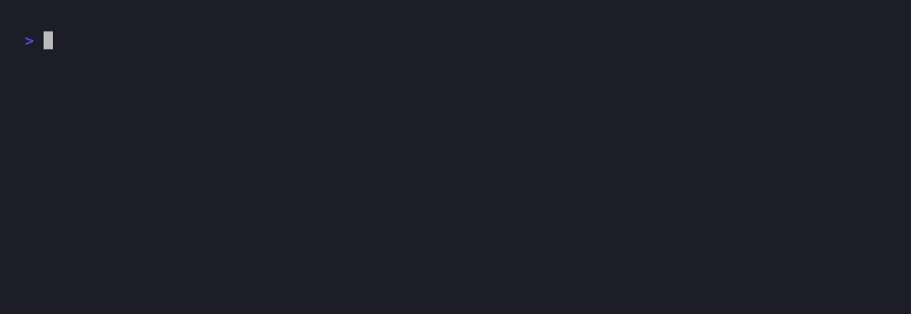
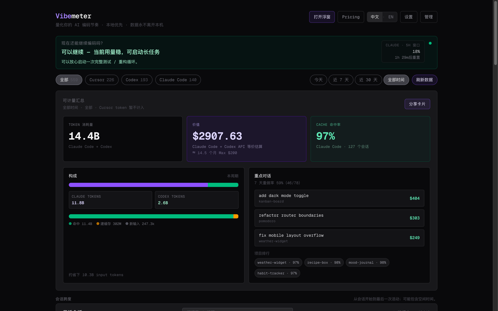
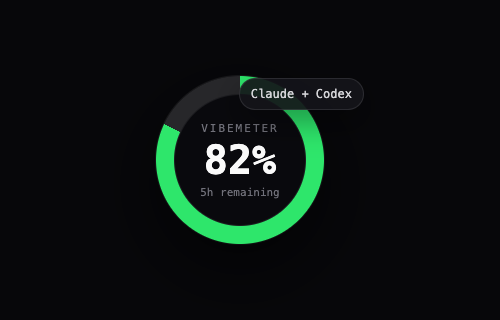
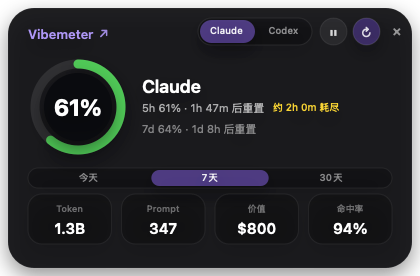

# Vibemeter

> Know if your next AI coding task can finish before quota, context, or reset timing cuts it off. Vibemeter is a local macOS runway console for Claude Code and Codex heavy users.

> 🔒 **Everything runs locally. No data ever leaves your machine.** No telemetry, no tracking, no cloud, no API calls out. Vibemeter reads files already on your disk and shows quota runway, sessions, and completion alerts from them. That's it.





<p align="center">
  
  &nbsp;&nbsp;
  
</p>

<p align="center"><sub>Native macOS floating widget — always-on quota ring (left) and expanded panel (right). Stays above your editor so the full dashboard is only one click away.</sub></p>

Website: <https://vibemeter.siney.top>

Install and launch with one command:

```bash
curl -fsSL 'https://vibemeter.siney.top/install.sh?src=readme' | bash
```

The installer downloads the Vibemeter tarball from <https://vibemeter.siney.top>, registers the local background service, waits for it to start, and opens the macOS floating widget. The full dashboard runs locally at <http://localhost:9527> for history, settings, reports, and debugging.

## What you get

- **Task runway check** — `vibemeter guard` tells you whether a long Claude/Codex task is safe to start
- **macOS runway console** — a native floating meter stays above your editor for live quota and context checks
- **Quota runway** — 5h / 7-day rate-limit windows for both Claude Code (statusline) and Codex (rollout files)
- **Context window monitor** *(new in 0.2.0)* — live 200k-token budget for the active Claude Code chat, on the floating widget and dashboard, with a "/compact soon" nudge before auto-compact triggers
- **Completion alerts** — optional macOS voice + notification hooks when Claude Code or Codex finishes
- **Git ↔ session linking** *(new in 0.2.0)* — every commit in tracked repos is matched to the agent session that produced it; click a row to see the shas
- **Cache hit-rate insight** *(new in 0.2.0)* — what % of every prompt is served from prompt-cache, by project and by session, plus a hint when the rate looks pathological
- **Share report** — copy a local Markdown report for V2EX, GitHub issues, or team chat
- **First-run Doctor** — `vibemeter doctor` checks local data sources, quota setup, and completion hooks
- **Burn-rate & reset visibility** — see recent usage history before a long agent task runs into a limit
- **Project cost context** — top projects by hours / sessions / tools used, plus Claude Code USD and Codex tokens
- **Sessions table** — searchable, tag-able, filterable by tool and date range
- **Activity review** — hour-of-week heatmap, today's timeline ribbon, and daily streak context
- **Local dashboard** — deep history and settings render from files already on your machine

## Quick start

The one-command installer is the recommended path for new users. It keeps everything local: data lives in `~/.vibemeter/`, and nothing is sent to Vibemeter or any cloud service.

Prefer doing it manually? Fetch the tarball, install it globally, then register and launch:

```bash
curl -fsSL https://vibemeter.siney.top/vibemeter.tgz -o /tmp/vibemeter.tgz
npm install -g /tmp/vibemeter.tgz
rm /tmp/vibemeter.tgz
vibemeter install
vibemeter float
```

> Vibemeter is no longer published to the npm registry — the old `@hirra/vibemeter` package on npm is frozen at 0.2.1 and unmaintained. Both paths above pull the current release from <https://vibemeter.siney.top>.

## Run in the foreground

```bash
vibemeter
```

Open <http://localhost:9527>. Hit Ctrl-C to stop.

## Run as a background service (macOS)

`vibemeter install` registers a LaunchAgent at `~/Library/LaunchAgents/com.hirra.vibemeter.plist`. It boots on login, restarts if it crashes, and writes logs to `~/.vibemeter/vibemeter.log`.

```bash
vibemeter status      # see if it's loaded + tail the log
vibemeter uninstall   # remove the LaunchAgent
```

On Linux, run `vibemeter install` and it'll print a systemd-user unit you can drop in `~/.config/systemd/user/vibemeter.service`.

## CLI reference

| Command                | What it does                                         |
| ---------------------- | ---------------------------------------------------- |
| `vibemeter`                | start the server in the foreground (Ctrl-C to stop)  |
| `vibemeter install`        | register a LaunchAgent so it runs on login (macOS)   |
| `vibemeter float`          | open the native macOS floating widget                |
| `vibemeter uninstall`      | remove the auto-start config                         |
| `vibemeter status`         | show whether the daemon is loaded + tail log         |
| `vibemeter guard`          | tell whether a long Claude/Codex task is safe to run |
| `vibemeter report`         | print a local Markdown share report                  |
| `vibemeter doctor`         | check local data sources and setup gaps              |
| `vibemeter pulse --json`   | print current 5h/weekly usage as JSON                |
| `vibemeter notify-install` | wire voice + macOS-notification hooks (Claude+Codex) |
| `vibemeter notify-status`  | show which voice hooks are installed                 |
| `vibemeter notify-uninstall` | remove the voice + notification hooks              |
| `vibemeter help`           | print usage                                          |

| Env var               | Default          |
| --------------------- | ---------------- |
| `PORT`                | `9527`           |
| `VIBEMETER_DATA_DIR`  | `~/.vibemeter`   |

## Where the data comes from

Vibemeter reads these files directly. Nothing is sent anywhere.

| Tool        | Source                                                                       |
| ----------- | ---------------------------------------------------------------------------- |
| Claude Code | `~/.claude/projects/**/*.jsonl`                                              |
| Claude Code | `~/.claude/sessions/*.json` (active-session flag)                            |
| Codex       | `~/.codex/state_5.sqlite` (thread metadata)                                  |
| Codex       | `~/.codex/sessions/**/rollout-*.jsonl` (rate-limit windows)                  |

If a tool's files don't exist, its cards just show "no data yet". Everything else still works.

## Claude Code 5h / 7-day cards (optional setup)

These cards need a statusline hook. Add this to `~/.claude/settings.json`:

```json
{
  "statusLine": {
    "type": "command",
    "command": "node -e \"const fs=require('fs'),os=require('os'),p=require('path');const d=p.join(os.homedir(),'.vibemeter');fs.mkdirSync(d,{recursive:true});fs.writeFileSync(p.join(d,'statusline-latest.json'),fs.readFileSync(0));\""
  }
}
```

Claude Code starts writing `~/.vibemeter/statusline-latest.json` on every status-line render. Vibemeter picks it up automatically.

Codex needs **no setup** — its 5h/7d data lives in `~/.codex/sessions/**/rollout-*.jsonl` already.

## Voice notifications (macOS)

Want Claude Code and Codex to **speak + show a notification** the moment they finish — no more tabbing back to check? Vibemeter ships a small speaker script and wires it into both tools for you.

```bash
vibemeter notify-install
```

That adds a Stop hook to `~/.claude/settings.json` and sets `notify = [...]` in `~/.codex/config.toml` (both backed up first). When an agent finishes, you'll hear a short *"Claude / Codex {project} 完成"* and see a banner — delivered through a small bundled `Vibemeter.app` so notifications carry the Vibemeter name + icon (system will ask for notification permission the first time). If the bundle isn't built yet, Vibemeter quietly falls back to `osascript`.

Toggle it from <http://localhost:9527/settings> — turn channels on/off, or remove everything with `vibemeter notify-uninstall`. If your Codex config already has a custom `notify` line, Vibemeter detects it and refuses to overwrite. The defaults use the **Tingting** Chinese voice (`say -v Tingting`); set `VIBEMETER_NOTIFY_VOICE` in the hook command to change it.

The installer for new users (`curl ... | bash`) also prompts to enable this during `vibemeter install` — accept or skip, you can always change later in Settings.

## Demo mode

Append `?demo=1` to the URL — anonymizes project names and injects mock sessions. Useful for screenshots and screen-sharing.

```
http://localhost:9527/?demo=1
```

## Run from source

```bash
git clone https://github.com/myhirra/Vibemeter.git
cd Vibemeter
npm install
npm run dev
```

Source mode uses `./.data/` instead of `~/.vibemeter/`. Override with `VIBEMETER_DATA_DIR=...`.

## Tech stack

- Next.js 16 (App Router, Turbopack), React 19, Tailwind v4
- better-sqlite3 for local storage
- Zero external services. Zero telemetry. Zero tracking.

## License

[MIT](./LICENSE)
